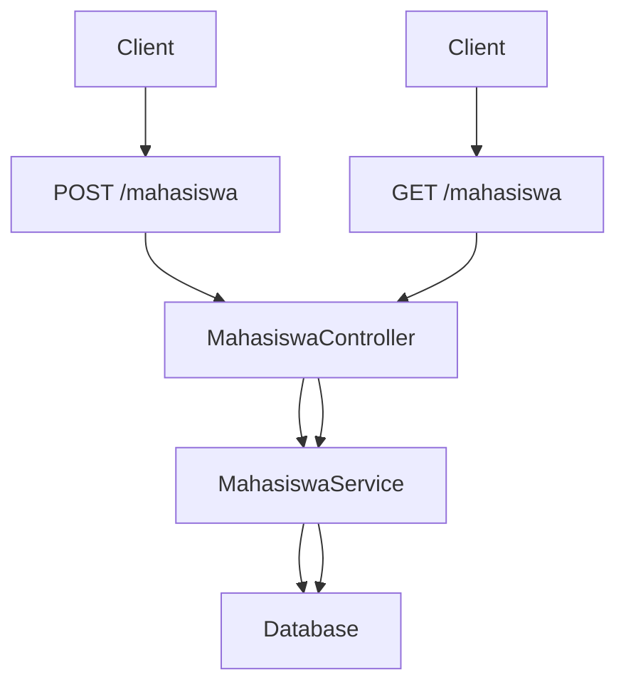
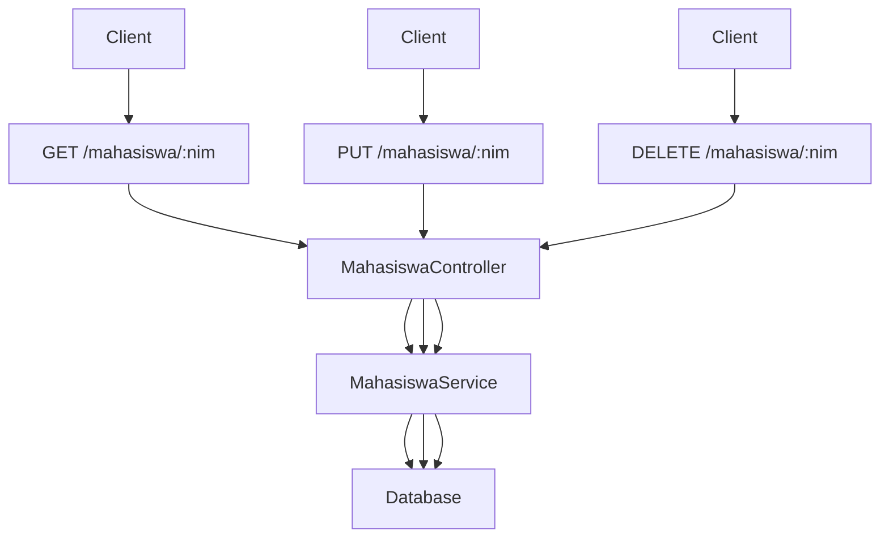
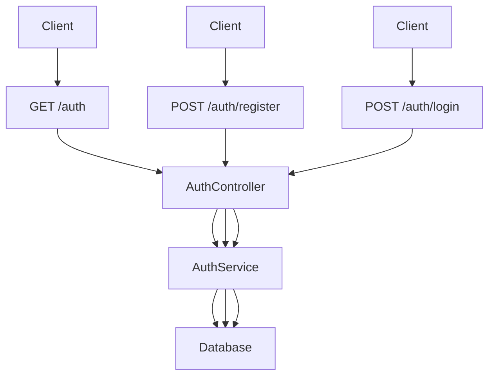
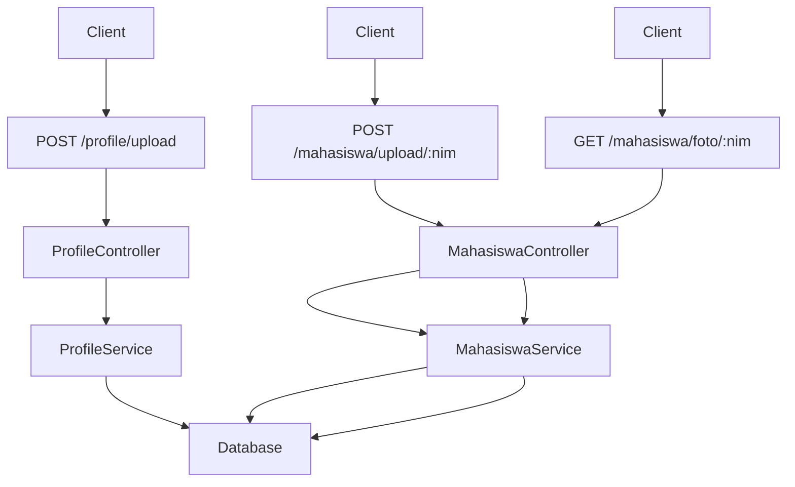
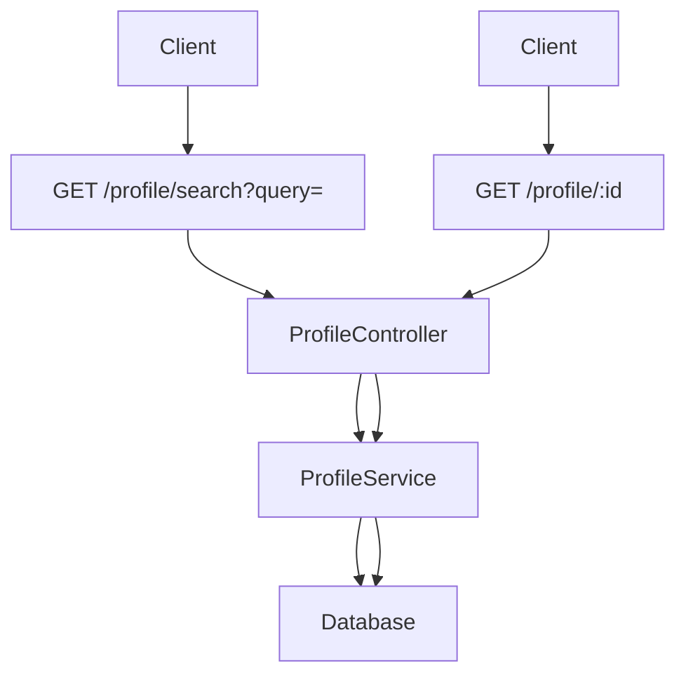
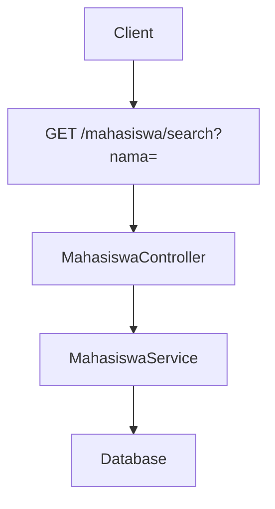
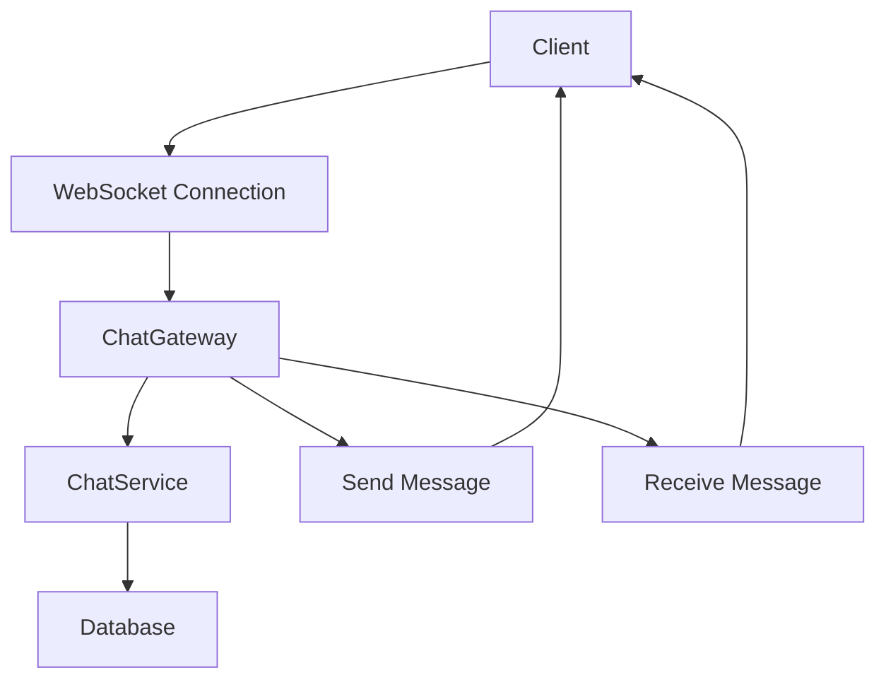

# NestJS Project 

## 1. Penjelasan Singkat

Repositori ini merupakan aplikasi backend yang dibangun menggunakan framework NestJS. Aplikasi ini memiliki beberapa fitur utama, yaitu manajemen data mahasiswa, autentikasi, manajemen profil, dan chat real-time menggunakan WebSocket. Struktur repositori ini diorganisir berdasarkan fitur-fitur yang ada, dengan setiap fitur memiliki modul, controller, dan service tersendiri.

### Struktur Direktori:
📦latihan-nest/
├── 📂node_modules/
├── 📂prisma/
│   ├── prisma.schema
├── 📂public/
│   ├── 🟨app.js
│   ├── 🟧index.html
│   ├── 🟦styles.css
├── 📂src/
│   ├── 📂chat/
│   |   |-- chat.gateaway.spec.ts
│   |   |-- chat.gateaway.ts
│   |   |-- chat.module.ts
│   |   |-- chat.service.spec.ts
│   |   |-- chat.service.ts
│   ├── 📂dto/
│   |   |-- create-mahasiswa.dto.ts
│   |   |-- register-user.dto.ts
│   ├── 📂entity/
│   |   |-- user.entity.ts
│   ├── 📂mahasiswa-profile/
│   |   |-- mahasiswa-profile.controller.spec.ts
│   |   |-- mahasiswa-profile.controller.ts
│   |   |-- mahasiswa-profile.module.ts
│   |   |-- mahasiswa-profile.service.spec.ts
│   |   |-- mahasiswa-profile.service.ts
│   ├── 📂profile/
│   |   |-- profile.controller.spec.ts
│   |   |-- profile.controller.ts
│   |   |-- profile.module.ts
│   |   |-- profile.service.spec.ts
│   |   |-- profile.service.ts
│   |-- app.controller.spec.ts
│   |-- app.controller.ts
│   |-- app.module.ts
│   |-- app.service.ts
│   |-- auth.guard.ts
│   |-- auth.module.ts
│   |-- 🟦main.ts
│   |-- 🟦prisma.ts
│   |-- 🟦user.decorator.ts
├── 📂test/
├── 📂uploads/
├── .env
├── .gitignore
├── .prettierrc
├── nest-cli.json
├── package-lock.json 
├── package.json 
├── README.md 
├── tsconfig.build.json 
├── tsconfig.json 
  
## 2. Cara Menjalankan Aplikasi

Untuk menjalankan aplikasi ini, ikuti langkah-langkah berikut:

1. **Clone repositori**:
   ```bash
   git clone https://github.com/username/repository-name.git
   cd repository-name
2. **Install Dependencies**:
    ```bash
    npm install
3. **Setup database**:
   - Pastikan database sudah terinstall dan berjalan.
   - Sesuaikan konfigurasi database di file prisma/schema.prisma.
   - Jalankan migrasi Prisma:
      ```bash
      npx prisma migrate dev --name init
5. **Jalankan Aplikasi**:
    ```bash
    npm run start
6. **Jalankan dalam mode development**(hot-reload):
   ```bash
   npm run start:dev
Aplikasi akan berjalan pada http://localhost:3000.

## 3. Penjelasan POST dan GET Mahasiswa
- **POST /mahasiswa**: Endpoint ini digunakan untuk menambahkan data mahasiswa baru ke dalam database. Data yang dikirim oleh client akan diproses oleh MahasiswaController, kemudian diteruskan ke MahasiswaService untuk validasi dan penyimpanan ke database.
- **GET /mahasiswa**: Endpoint ini digunakan untuk mengambil semua data mahasiswa yang tersimpan di database. Permintaan dari client akan diproses oleh MahasiswaController dan MahasiswaService sebelum mengembalikan data ke client.
**Diagram Alur**:

## 4. Penjelasan GET, PUT, DELETE Mahasiswa by NIM
- **GET /mahasiswa/:nim**: Endpoint ini digunakan untuk mengambil data mahasiswa berdasarkan NIM. NIM dikirim sebagai parameter dalam URL, dan data yang sesuai akan dicari di database.
- **PUT /mahasiswa/:nim**: Endpoint ini digunakan untuk mengupdate data mahasiswa berdasarkan NIM. Data baru dikirim oleh client, dan data lama akan diupdate di database.
- **DELETE /mahasiswa/:nim**: Endpoint ini digunakan untuk menghapus data mahasiswa berdasarkan NIM. Data yang sesuai dengan NIM akan dihapus dari database.
**Diagram Alur**:

## 5. Penjelasan GET Auth, POST Register, dan POST Login
- **GET /auth**: Endpoint ini digunakan untuk mendapatkan informasi autentikasi, seperti status login atau token.
- **POST /auth/register**: Endpoint ini digunakan untuk mendaftarkan user baru. Data registrasi (seperti username dan password) akan disimpan di database.
- **POST /auth/login**: Endpoint ini digunakan untuk proses login. Client mengirimkan username dan password, dan sistem akan memverifikasi data tersebut sebelum memberikan akses.
**Diagram Alur**:

## 6. Penjelasan POST Profile/Upload, POST Mahasiswa/Upload by NIM, GET Mahasiswa/Foto by NIM
- **POST /profile/upload**: Endpoint ini digunakan untuk mengupload foto profil user. File yang diupload akan diproses dan disimpan di database atau sistem penyimpanan.
- **POST /mahasiswa/upload/:nim**: Endpoint ini digunakan untuk mengupload foto mahasiswa berdasarkan NIM. File foto akan dikaitkan dengan data mahasiswa yang sesuai.
- **GET /mahasiswa/foto/:nim**: Endpoint ini digunakan untuk mengambil foto mahasiswa berdasarkan NIM. Foto akan diambil dari database atau sistem penyimpanan dan dikirim ke client.
**Diagram Alur**:

## 7. Penjelasan GET Profile/Search dan GET Profile by ID
- **GET /profile/search**: Endpoint ini digunakan untuk mencari profil berdasarkan query tertentu, seperti nama atau email. Hasil pencarian akan dikembalikan ke client.
- **GET /profile/:id**: Endpoint ini digunakan untuk mengambil data profil berdasarkan ID. ID dikirim sebagai parameter dalam URL, dan data yang sesuai akan dicari di database.
**Diagram Alur**:

## 8. Penjelasan GET Mahasiswa/Search by Nama
**GET /mahasiswa/search**: Endpoint ini digunakan untuk mencari data mahasiswa berdasarkan nama. Query nama dikirim oleh client, dan sistem akan mencari data yang sesuai di database.
**Diagram Alur**:

## 9. Penjelasan Chat Menggunakan Socket
- **WebSocket Connection**: Client terhubung ke server menggunakan WebSocket untuk komunikasi real-time.
- **ChatGateway**: Gateway yang menangani koneksi WebSocket dan mengelola pesan yang dikirim dan diterima.
- **ChatService**: Service yang menangani logika bisnis, seperti menyimpan pesan ke database atau mengirim pesan ke client lain.
- **Send/Receive Message**: Client dapat mengirim pesan ke server dan menerima pesan dari client lain secara real-time.
**Diagram Alur**:

