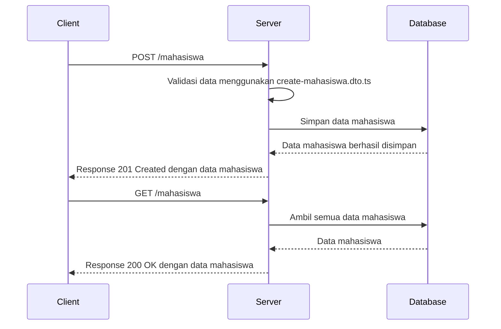
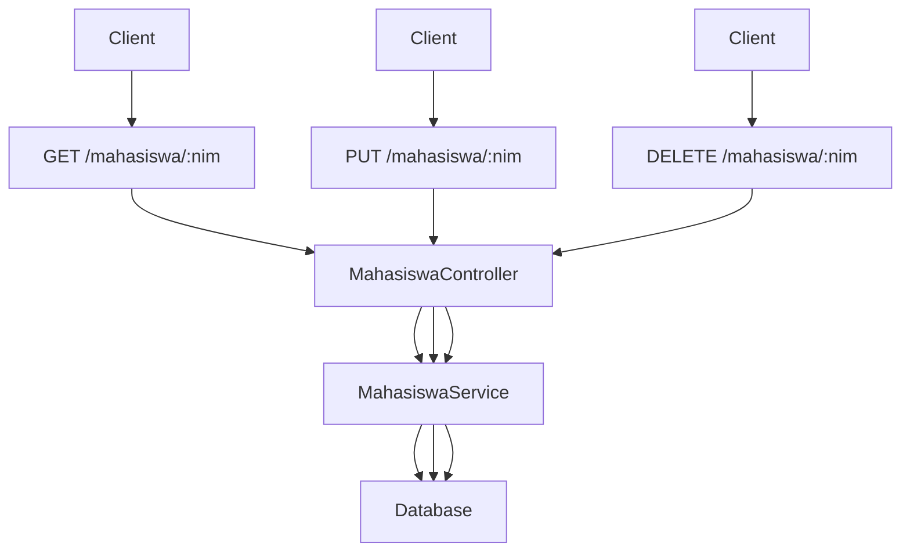
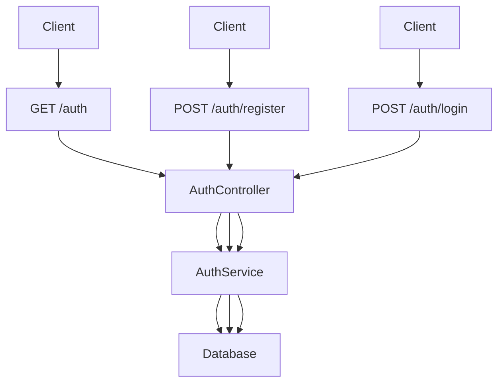
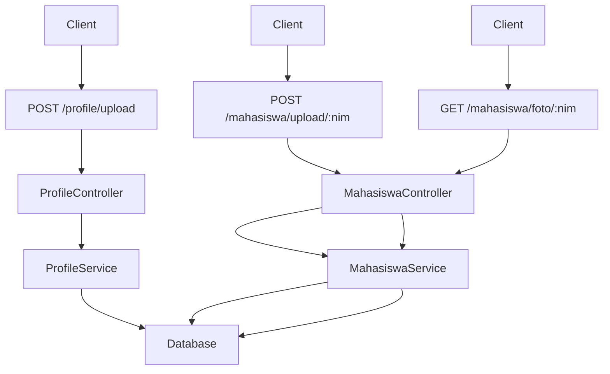
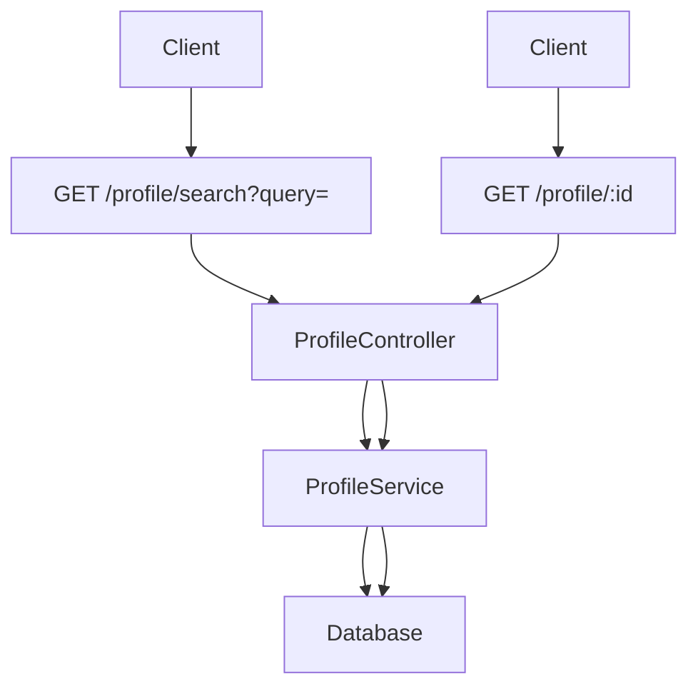
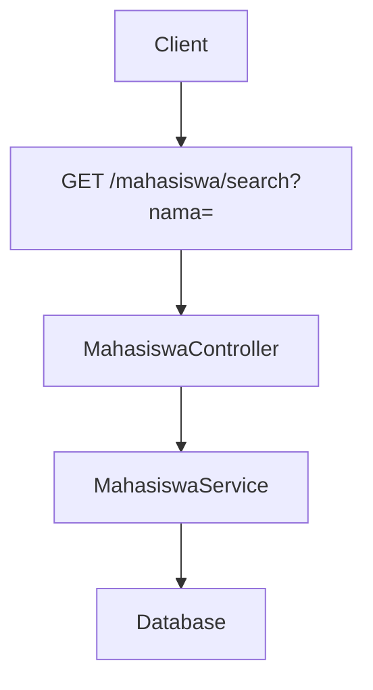
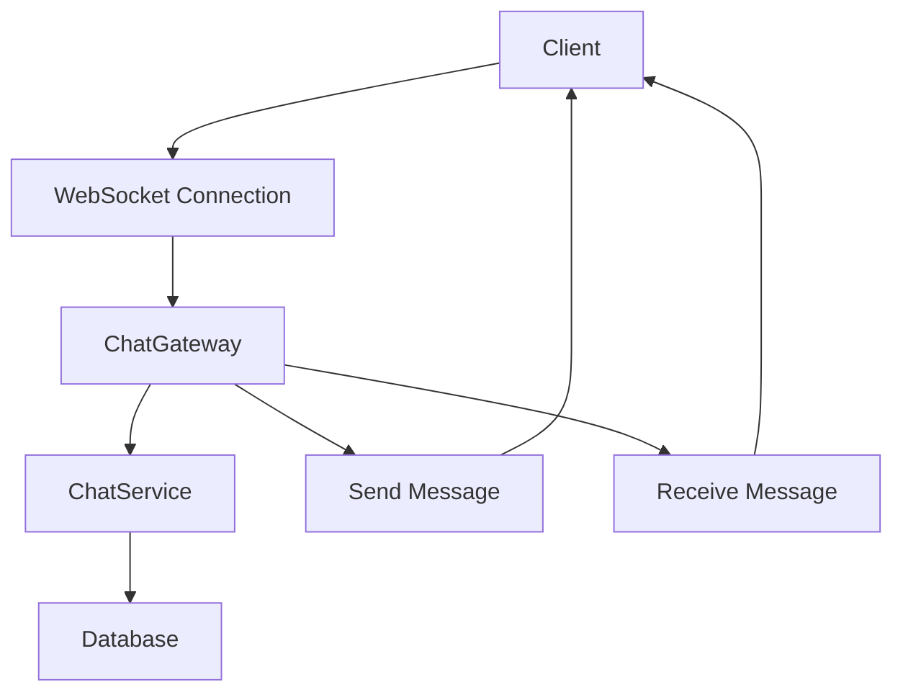

# NestJS Project 

## 1. Penjelasan Singkat

Repositori ini merupakan aplikasi backend yang dibangun menggunakan framework NestJS. Aplikasi ini memiliki beberapa fitur utama, yaitu manajemen data mahasiswa, autentikasi, manajemen profil, dan chat real-time menggunakan WebSocket. Struktur repositori ini diorganisir berdasarkan fitur-fitur yang ada, dengan setiap fitur memiliki modul, controller, dan service tersendiri.

### Struktur Direktori:
```
📦 latihan-nest/
├── 📂node_modules/         # Direktori dependensi Node.js
├── 📂prisma/               # Konfigurasi Prisma ORM
│   ├── prisma.schema      # Skema Prisma untuk database
├── 📂src/                  # Direktori utama kode sumber
│   ├── 📂chat/             # Modul chat dengan WebSocket
│   |   |-- chat.gateaway.spec.ts  # Unit test untuk chat gateway
│   |   |-- chat.gateaway.ts       # Implementasi WebSocket gateway
│   |   |-- chat.module.ts         # Modul chat
│   |   |-- chat.service.spec.ts   # Unit test untuk chat service
│   |   |-- chat.service.ts        # Service untuk fitur chat
│   ├── 📂dto/              # Data Transfer Objects (DTOs)
│   |   |-- create-mahasiswa.dto.ts  # DTO untuk mahasiswa
│   |   |-- update-mahasiswa.dto.ts  # DTO untuk mahasiswa
│   |   |-- register-user.dto.ts      # DTO untuk registrasi pengguna
│   |   |-- login-user.dto.ts      # DTO untuk login pengguna
│   ├── 📂entity/           # Entity untuk database
│   |   |-- user.entity.ts  # Definisi entitas pengguna
│   ├── 📂profile/            # Modul profil umum
│   |   |-- profile.controller.spec.ts  # Unit test controller profil
│   |   |-- profile.controller.ts       # Controller profil
│   |   |-- profile.module.ts           # Modul profil
│   |   |-- profile.service.spec.ts     # Unit test service profil
│   |   |-- profile.service.ts          # Service untuk profil
│   |-- app.controller.spec.ts  # Unit test controller utama
│   |-- app.controller.ts       # Controller utama aplikasi
│   |-- app.module.ts           # Modul utama aplikasi
│   |-- app.service.ts          # Service utama aplikasi
│   |-- auth.guard.ts           # Middleware untuk autentikasi
│   |-- auth.module.ts          # Modul autentikasi
│   |-- main.ts              # File utama untuk menjalankan aplikasi
│   |-- prisma.ts            # Konfigurasi koneksi Prisma
│   |-- user.decorator.ts    # Custom decorator untuk user
├── 📂test/                # Direktori untuk unit testing
├── 📂uploads/             # Direktori untuk penyimpanan file yang diunggah
├── .env                   # File konfigurasi environment
├── .gitignore             # File untuk mengabaikan file yang tidak perlu dalam Git
├── .prettierrc            # Konfigurasi Prettier untuk code formatting
├── nest-cli.json          # Konfigurasi CLI NestJS
├── package-lock.json      # File lock dependencies
├── package.json           # File konfigurasi npm
├── README.md              # Dokumentasi proyek
├── tsconfig.build.json    # Konfigurasi TypeScript untuk build
├── tsconfig.json          # Konfigurasi utama TypeScript
```
## 2. Cara Menjalankan Aplikasi

Untuk menjalankan aplikasi ini, ikuti langkah-langkah berikut:

1. **Clone repositori**:
   ```bash
   git clone https://github.com/username/repository-name.git
   cd repository-name
2. **Install Dependencies**:
    ```bash
    npm install
3. **Setup database**:
   - Pastikan database sudah terinstall dan berjalan.
   - Sesuaikan konfigurasi database di file prisma/schema.prisma.
   - Jalankan migrasi Prisma:
      ```bash
      npx prisma migrate dev --name init
5. **Jalankan Aplikasi**:
    ```bash
    npm run start
6. **Jalankan dalam mode development**(hot-reload):
   ```bash
   npm run start:dev
Aplikasi akan berjalan pada http://localhost:3000.

## 3. Penjelasan POST dan GET Mahasiswa
1. POST Mahasiswa
**Endpoint**: /mahasiswa
**Method**: POST
**Fungsi**: Untuk menambahkan data mahasiswa baru ke dalam database.
**Proses**:
- Client mengirimkan request POST ke endpoint /mahasiswa dengan payload berupa data mahasiswa (misalnya: nama, nim, jenis kelamin, jurusan).
- Server menerima request dan memvalidasi data menggunakan DTO (create-mahasiswa.dto.ts).
- Jika valid, data mahasiswa akan disimpan ke dalam database menggunakan Prisma ORM.
- Server mengembalikan response berupa data mahasiswa yang baru saja dibuat beserta status code 201 Created.
2. GET Mahasiswa
**Endpoint**: /mahasiswa 
**Method**: GET
**Fungsi**: Untuk mengambil data mahasiswa, baik semua data mahasiswa atau data mahasiswa tertentu berdasarkan ID.
**Proses**:
- Client mengirimkan request GET ke endpoint /mahasiswa untuk mengambil semua data mahasiswa atau /mahasiswa/:id untuk mengambil data mahasiswa tertentu.
- Server menerima request dan memprosesnya.
- Jika endpoint adalah /mahasiswa, server akan mengambil semua data mahasiswa dari database.
- Jika endpoint adalah /mahasiswa/:id, server akan mengambil data mahasiswa berdasarkan ID yang diberikan.
- Server mengembalikan response berupa data mahasiswa yang diminta beserta status code 200 OK.

**Diagram Alur POST dan GET Mahasiswa**
Berikut adalah diagram alur untuk proses POST dan GET Mahasiswa

## 4. Penjelasan GET, PUT, DELETE Mahasiswa by NIM
- **GET /mahasiswa/:nim**: Endpoint ini digunakan untuk mengambil data mahasiswa berdasarkan NIM. NIM dikirim sebagai parameter dalam URL, dan data yang sesuai akan dicari di database.
- **PUT /mahasiswa/:nim**: Endpoint ini digunakan untuk mengupdate data mahasiswa berdasarkan NIM. Data baru dikirim oleh client, dan data lama akan diupdate di database.
- **DELETE /mahasiswa/:nim**: Endpoint ini digunakan untuk menghapus data mahasiswa berdasarkan NIM. Data yang sesuai dengan NIM akan dihapus dari database.
**Diagram Alur**:

## 5. Penjelasan GET Auth, POST Register, dan POST Login
- **GET /auth**: Endpoint ini digunakan untuk mendapatkan informasi autentikasi, seperti status login atau token.
- **POST /auth/register**: Endpoint ini digunakan untuk mendaftarkan user baru. Data registrasi (seperti username dan password) akan disimpan di database.
- **POST /auth/login**: Endpoint ini digunakan untuk proses login. Client mengirimkan username dan password, dan sistem akan memverifikasi data tersebut sebelum memberikan akses.
**Diagram Alur**:

## 6. Penjelasan POST Profile/Upload, POST Mahasiswa/Upload by NIM, GET Mahasiswa/Foto by NIM
- **POST /profile/upload**: Endpoint ini digunakan untuk mengupload foto profil user. File yang diupload akan diproses dan disimpan di database atau sistem penyimpanan.
- **POST /mahasiswa/upload/:nim**: Endpoint ini digunakan untuk mengupload foto mahasiswa berdasarkan NIM. File foto akan dikaitkan dengan data mahasiswa yang sesuai.
- **GET /mahasiswa/foto/:nim**: Endpoint ini digunakan untuk mengambil foto mahasiswa berdasarkan NIM. Foto akan diambil dari database atau sistem penyimpanan dan dikirim ke client.
**Diagram Alur**:

## 7. Penjelasan GET Profile/Search dan GET Profile by ID
- **GET /profile/search**: Endpoint ini digunakan untuk mencari profil berdasarkan query tertentu, seperti nama atau email. Hasil pencarian akan dikembalikan ke client.
- **GET /profile/:id**: Endpoint ini digunakan untuk mengambil data profil berdasarkan ID. ID dikirim sebagai parameter dalam URL, dan data yang sesuai akan dicari di database.
**Diagram Alur**:

## 8. Penjelasan GET Mahasiswa/Search by Nama
**GET /mahasiswa/search**: Endpoint ini digunakan untuk mencari data mahasiswa berdasarkan nama. Query nama dikirim oleh client, dan sistem akan mencari data yang sesuai di database.
**Diagram Alur**:

## 9. Penjelasan Chat Menggunakan Socket
- **WebSocket Connection**: Client terhubung ke server menggunakan WebSocket untuk komunikasi real-time.
- **ChatGateway**: Gateway yang menangani koneksi WebSocket dan mengelola pesan yang dikirim dan diterima.
- **ChatService**: Service yang menangani logika bisnis, seperti menyimpan pesan ke database atau mengirim pesan ke client lain.
- **Send/Receive Message**: Client dapat mengirim pesan ke server dan menerima pesan dari client lain secara real-time.
**Diagram Alur**:

