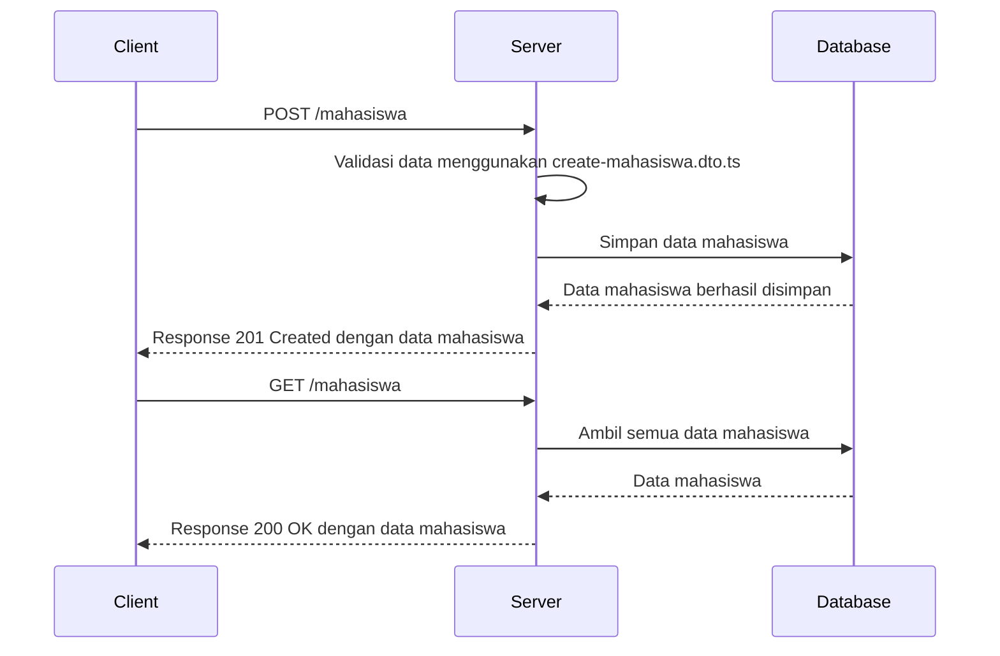
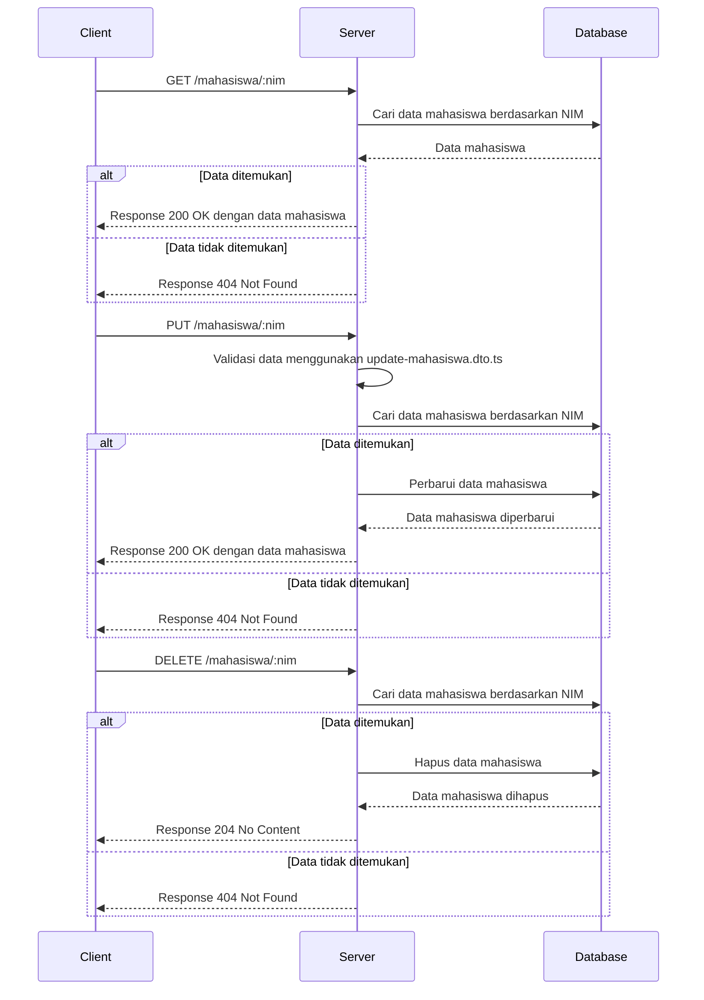
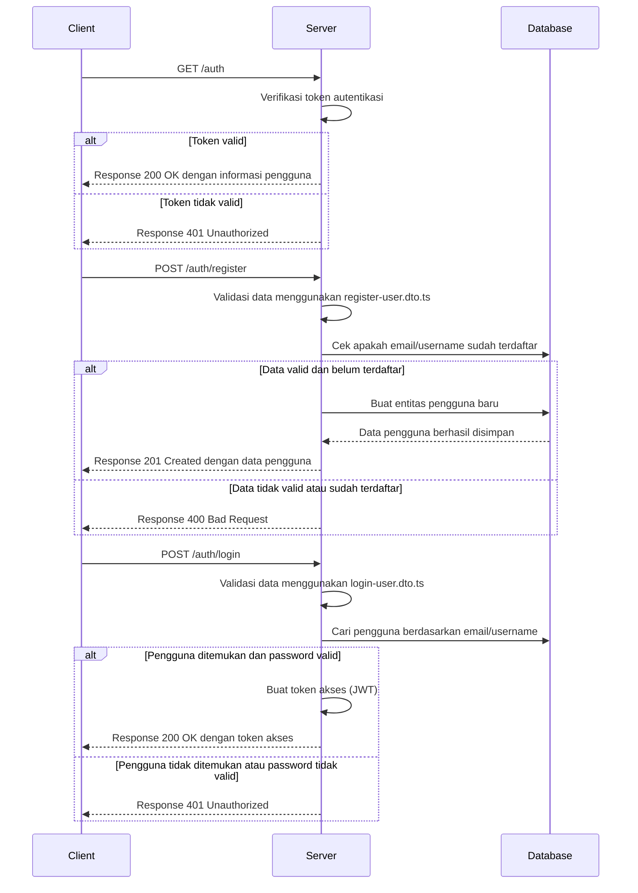
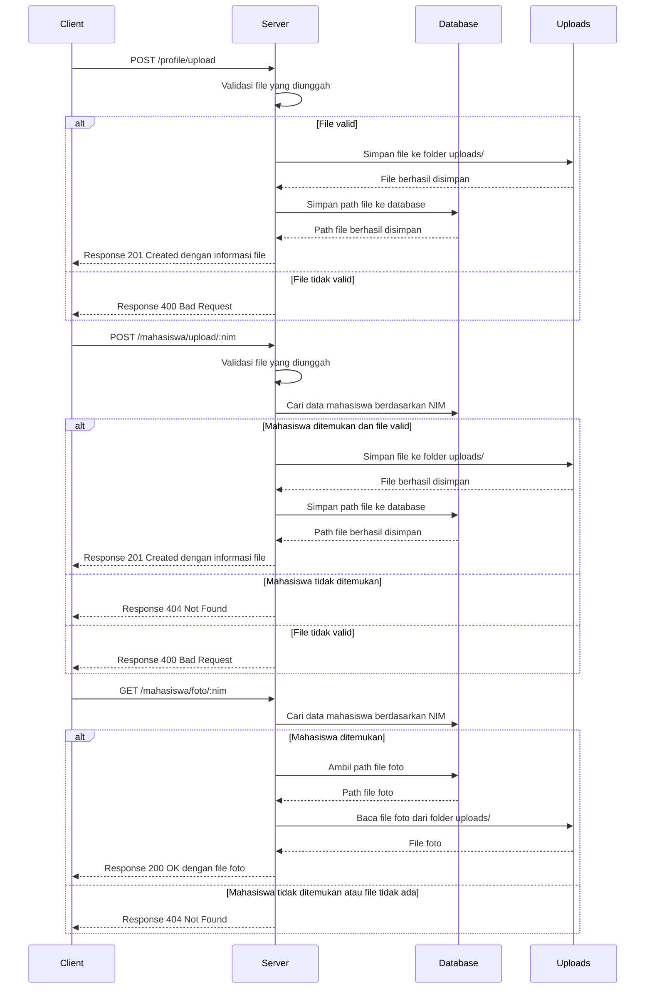
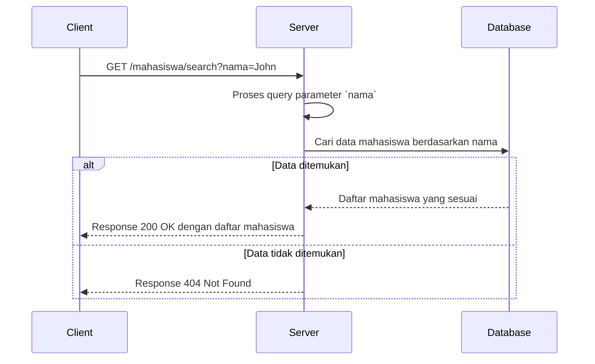
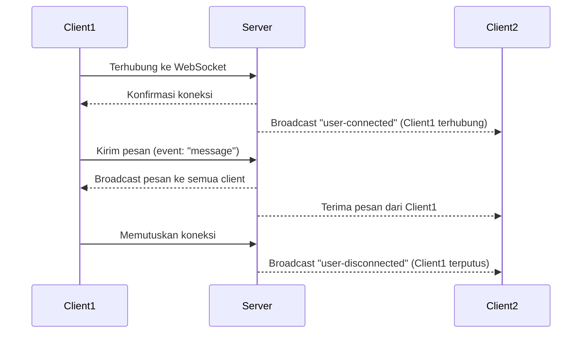

# NestJS Project 

## 1. Penjelasan Singkat

Repositori ini merupakan aplikasi backend yang dibangun menggunakan framework NestJS. Aplikasi ini memiliki beberapa fitur utama, yaitu manajemen data mahasiswa, autentikasi, manajemen profil, dan chat real-time menggunakan WebSocket. Struktur repositori ini diorganisir berdasarkan fitur-fitur yang ada, dengan setiap fitur memiliki modul, controller, dan service tersendiri.

### Struktur Direktori:
```
📦 latihan-nest/
├── 📂node_modules/         # Direktori dependensi Node.js
├── 📂prisma/               # Konfigurasi Prisma ORM
│   ├── prisma.schema      # Skema Prisma untuk database
├── 📂src/                  # Direktori utama kode sumber
│   ├── 📂chat/             # Modul chat dengan WebSocket
│   |   |-- chat.gateaway.spec.ts  # Unit test untuk chat gateway
│   |   |-- chat.gateaway.ts       # Implementasi WebSocket gateway
│   |   |-- chat.module.ts         # Modul chat
│   |   |-- chat.service.spec.ts   # Unit test untuk chat service
│   |   |-- chat.service.ts        # Service untuk fitur chat
│   ├── 📂dto/              # Data Transfer Objects (DTOs)
│   |   |-- create-mahasiswa.dto.ts  # DTO untuk mahasiswa
│   |   |-- update-mahasiswa.dto.ts  # DTO untuk mahasiswa
│   |   |-- register-user.dto.ts      # DTO untuk registrasi pengguna
│   |   |-- login-user.dto.ts      # DTO untuk login pengguna
│   ├── 📂entity/           # Entity untuk database
│   |   |-- user.entity.ts  # Definisi entitas pengguna
│   ├── 📂profile/            # Modul profil umum
│   |   |-- profile.controller.spec.ts  # Unit test controller profil
│   |   |-- profile.controller.ts       # Controller profil
│   |   |-- profile.module.ts           # Modul profil
│   |   |-- profile.service.spec.ts     # Unit test service profil
│   |   |-- profile.service.ts          # Service untuk profil
│   |-- app.controller.spec.ts  # Unit test controller utama
│   |-- app.controller.ts       # Controller utama aplikasi
│   |-- app.module.ts           # Modul utama aplikasi
│   |-- app.service.ts          # Service utama aplikasi
│   |-- auth.guard.ts           # Middleware untuk autentikasi
│   |-- auth.module.ts          # Modul autentikasi
│   |-- main.ts              # File utama untuk menjalankan aplikasi
│   |-- prisma.ts            # Konfigurasi koneksi Prisma
│   |-- user.decorator.ts    # Custom decorator untuk user
├── 📂test/                # Direktori untuk unit testing
├── 📂uploads/             # Direktori untuk penyimpanan file yang diunggah
├── .env                   # File konfigurasi environment
├── .gitignore             # File untuk mengabaikan file yang tidak perlu dalam Git
├── .prettierrc            # Konfigurasi Prettier untuk code formatting
├── nest-cli.json          # Konfigurasi CLI NestJS
├── package-lock.json      # File lock dependencies
├── package.json           # File konfigurasi npm
├── README.md              # Dokumentasi proyek
├── tsconfig.build.json    # Konfigurasi TypeScript untuk build
├── tsconfig.json          # Konfigurasi utama TypeScript
```
## 2. Cara Menjalankan Aplikasi

Untuk menjalankan aplikasi ini, ikuti langkah-langkah berikut:

1. **Clone repositori**:
   ```bash
   git clone https://github.com/username/repository-name.git
   cd repository-name
2. **Install Dependencies**:
    ```bash
    npm install
3. **Setup database**:
   - Pastikan database sudah terinstall dan berjalan.
   - Sesuaikan konfigurasi database di file prisma/schema.prisma.
   - Jalankan migrasi Prisma:
      ```bash
      npx prisma migrate dev --name init
5. **Jalankan Aplikasi**:
    ```bash
    npm run start
6. **Jalankan dalam mode development**(hot-reload):
   ```bash
   npm run start:dev
Aplikasi akan berjalan pada http://localhost:3000.

## 3. Penjelasan POST dan GET Mahasiswa
### 1. **POST Mahasiswa**
- **Endpoint**: /mahasiswa
- **Method**: POST
- **Fungsi**: Untuk menambahkan data mahasiswa baru ke dalam database.
- **Proses**:
  1. Client mengirimkan request POST ke endpoint /mahasiswa dengan payload berupa data mahasiswa (misalnya: nama, nim, jenis kelamin, jurusan).
  2. Server menerima request dan memvalidasi data menggunakan DTO (create-mahasiswa.dto.ts).
  3. Jika valid, data mahasiswa akan disimpan ke dalam database menggunakan Prisma ORM.Server mengembalikan response berupa data mahasiswa yang baru saja dibuat beserta status code 201 Created.

### 2. **GET Mahasiswa**
- **Endpoint**: /mahasiswa 
- **Method**: GET
- **Fungsi**: Untuk mengambil data mahasiswa, baik semua data mahasiswa atau data mahasiswa tertentu berdasarkan ID.
- **Proses**:
  1. Client mengirimkan request GET ke endpoint /mahasiswa untuk mengambil semua data mahasiswa atau /mahasiswa/:id untuk mengambil data mahasiswa tertentu.
  2. Server menerima request dan memprosesnya.
  3. Jika endpoint adalah /mahasiswa, server akan mengambil semua data mahasiswa dari database.
  4. Jika endpoint adalah /mahasiswa/:id, server akan mengambil data mahasiswa berdasarkan ID yang diberikan.
  5. Server mengembalikan response berupa data mahasiswa yang diminta beserta status code 200 OK.
### **Diagram Alur POST dan GET Mahasiswa**
Berikut adalah diagram alur untuk proses POST dan GET Mahasiswa

## 4. Penjelasan GET, PUT, DELETE Mahasiswa by NIM
### 1. **GET Mahasiswa by NIM**
- **Endpoint**: /mahasiswa/:nim
- **Method**: GET
- **Fungsi**: Untuk mengambil data mahasiswa tertentu berdasarkan NIM (Nomor Induk Mahasiswa).
- **Proses**:
  1. Client mengirimkan request GET ke endpoint /mahasiswa/:nim dengan menyertakan NIM mahasiswa yang ingin diambil datanya.
  2. Server menerima request dan memprosesnya.
  3. Server mencari data mahasiswa di database berdasarkan NIM yang diberikan.
  4. Jika data ditemukan, server mengembalikan response berupa data mahasiswa tersebut dengan status code 200 OK.
  5. Jika data tidak ditemukan, server mengembalikan response dengan status code 404 Not Found.
### 2. **PUT Mahasiswa by NIM**
- **Endpoint**: /mahasiswa/:nim
- **Method**: PUT
- **Fungsi**: Untuk memperbarui data mahasiswa tertentu berdasarkan NIM.
- **Proses**:
  1. Client mengirimkan request PUT ke endpoint /mahasiswa/:nim dengan menyertakan NIM mahasiswa yang ingin diperbarui dan payload berupa data baru (misalnya: nama, jenis kelamin, jurusan).
  2. Server menerima request dan memvalidasi data menggunakan DTO (update-mahasiswa.dto.ts).
  3. Jika valid, server mencari data mahasiswa di database berdasarkan NIM yang diberikan.
  4. Jika data ditemukan, server memperbarui data mahasiswa tersebut dengan data baru.
  5. Server mengembalikan response berupa data mahasiswa yang telah diperbarui dengan status code 200 OK.
  6. Jika data tidak ditemukan, server mengembalikan response dengan status code 404 Not Found.
### 3. **DELETE Mahasiswa by NIM**
- **Endpoint**: /mahasiswa/:nim
- **Method**: DELETE
- **Fungsi**: Untuk menghapus data mahasiswa tertentu berdasarkan NIM.
- **Proses**:
  1. Client mengirimkan request DELETE ke endpoint /mahasiswa/:nim dengan menyertakan NIM mahasiswa yang ingin dihapus.
  2. Server menerima request dan memprosesnya.
  3. Server mencari data mahasiswa di database berdasarkan NIM yang diberikan.
  4. Jika data ditemukan, server menghapus data mahasiswa tersebut dari database.
  5. Server mengembalikan response dengan status code 204 No Content (atau 200 OK dengan pesan sukses).
  6. Jika data tidak ditemukan, server mengembalikan response dengan status code 404 Not Found.
### **Diagram Alur GET, PUT, DELETE Mahasiswa by NIM**
Berikut adalah diagram alur untuk proses GET, PUT, DELETE Mahasiswa by NIM

## 5. Penjelasan GET Auth, POST Register, dan POST Login
### 1. **GET Auth**
- **Endpoint**: /auth
- **Method**: GET
- **Fungsi**:Untuk memverifikasi status autentikasi pengguna (misalnya, mengecek apakah pengguna sudah login atau belum).
- **Proses**:
  1. Client mengirimkan request GET ke endpoint /auth dengan menyertakan token autentikasi (biasanya di header Authorization).
  2. Server menerima request dan memverifikasi token autentikasi menggunakan auth.guard.ts.
  3. Jika token valid, server mengembalikan response berupa informasi pengguna yang terautentikasi dengan status code 200 OK.
  4. Jika token tidak valid atau tidak ada, server mengembalikan response dengan status code 401 Unauthorized.
### 2. **POST Register**
- **Endpoint**: /auth/register
- **Method**: POST
- **Fungsi**: Untuk mendaftarkan pengguna baru ke dalam sistem.
- **Proses**:
  1. Client mengirimkan request POST ke endpoint /auth/register dengan payload berupa data registrasi (misalnya: nama, email, password) yang sesuai dengan DTO (register-user.dto.ts).
  2. Server menerima request dan memvalidasi data menggunakan DTO.
  3. Jika valid, server memeriksa apakah email atau username sudah terdaftar di database.
  4. Jika belum terdaftar, server membuat entitas pengguna baru dan menyimpannya ke database menggunakan Prisma ORM.
  5. Server mengembalikan response berupa data pengguna yang baru saja dibuat beserta status code 201 Created.
  6. Jika username sudah terdaftar, server mengembalikan response dengan status code 400 Bad Request.
### 3. **POST Login**
- **Endpoint**: /auth/login
- **Method**: POST
- **Fungsi**: ntuk mengautentikasi pengguna dan memberikan token akses (access token).
- **Proses**:
  1. Client mengirimkan request POST ke endpoint /auth/login dengan payload berupa data login (misalnya: email/username dan password) yang sesuai dengan DTO (login-user.dto.ts).
  2. Server menerima request dan memvalidasi data menggunakan DTO.
  3. Jika valid, server mencari pengguna di database berdasarkan email atau username.
  4. Jika pengguna ditemukan, server memverifikasi password yang diberikan dengan password yang tersimpan di database (biasanya menggunakan hashing seperti bcrypt).
  5. Jika password valid, server membuat token akses (misalnya, JWT) dan mengembalikan response berupa token tersebut dengan status code 200 OK.
  6. Jika pengguna tidak ditemukan atau password tidak valid, server mengembalikan response dengan status code 401 Unauthorized.
### **Diagram Alur GET Auth, POST Register, dan POST Login**
Berikut adalah diagram alur untuk proses GET Auth, POST Register, dan POST Login

## 6. Penjelasan POST Profile/Upload, POST Mahasiswa/Upload by NIM, GET Mahasiswa/Foto by NIM
### 1. **POST Profile/Upload**
- **Endpoint**: /profile/upload
- **Method**: POST
- **Fungsi**:Untuk mengunggah foto profil pengguna.
- **Proses**:
  1. Client mengirimkan request POST ke endpoint /profile/upload dengan menyertakan file foto (misalnya, dalam bentuk multipart/form-data).
  2. Server menerima request dan memvalidasi file yang diunggah (misalnya, memeriksa ukuran dan tipe file).
  3. Jika file valid, server menyimpan file ke folder uploads/ dan menyimpan path file ke database (misalnya, di tabel user atau profile).
  4. Server mengembalikan response berupa informasi file yang berhasil diunggah (misalnya, nama file dan path) dengan status code 201 Created.
  5. Jika file tidak valid, server mengembalikan response dengan status code 400 Bad Request.
### 2. **POST Mahasiswa/Upload by NIM**
- **Endpoint**: /mahasiswa/upload/:nim
- **Method**: POST
- **Fungsi**: Untuk mengunggah foto mahasiswa berdasarkan NIM (Nomor Induk Mahasiswa).
- **Proses**:
  1. Client mengirimkan request POST ke endpoint /mahasiswa/upload/:nim dengan menyertakan file foto dan NIM mahasiswa.
  2. Server menerima request dan memvalidasi file yang diunggah.
  3. Server mencari data mahasiswa di database berdasarkan NIM yang diberikan.
  4. Jika mahasiswa ditemukan, server menyimpan file ke folder uploads/ dan menyimpan path file ke database (misalnya, di tabel mahasiswa).
  5. Server mengembalikan response berupa informasi file yang berhasil diunggah dengan status code 201 Created.
  6. Jika mahasiswa tidak ditemukan, server mengembalikan response dengan status code 404 Not Found.
  7. Jika file tidak valid, server mengembalikan response dengan status code 400 Bad Request.
### 3. **GET Mahasiswa/Foto by NIM**
- **Endpoint**: /mahasiswa/foto/:nim
- **Method**: GET
- **Fungsi**: Untuk mengambil foto mahasiswa berdasarkan NIM.
- **Proses**:
  1. Client mengirimkan request GET ke endpoint /mahasiswa/foto/:nim dengan menyertakan NIM mahasiswa.
  2. Server menerima request dan mencari data mahasiswa di database berdasarkan NIM yang diberikan.
  3. Jika mahasiswa ditemukan, server mengambil path file foto dari database.
  4. Server membaca file foto dari folder uploads/ dan mengembalikannya sebagai response dengan status code 200 OK.
  5. Jika mahasiswa tidak ditemukan atau file foto tidak ada, server mengembalikan response dengan status code 404 Not Found.
### **Diagram Alur POST Profile/Upload, POST Mahasiswa/Upload by NIM, dan GET Mahasiswa/Foto by NIM**
Berikut adalah diagram alur untuk proses POST Profile/Upload, POST Mahasiswa/Upload by NIM, dan GET Mahasiswa/Foto by NIM

## 7. Penjelasan GET Mahasiswa/Search by Nama
### 1. **GET Mahasiswa/Search by Nama**
- **Endpoint**:/mahasiswa/search
- **Method**: GET
- **Fungsi**:Untuk mencari data mahasiswa berdasarkan nama atau bagian dari nama.
- **Proses**:
  1. Client mengirimkan request GET ke endpoint /mahasiswa/search dengan menyertakan query parameter nama (misalnya, ?nama=Erika yanti).
  2. Server menerima request dan memproses query parameter nama.
  3. Server mencari data mahasiswa di database berdasarkan nama atau bagian dari nama yang diberikan (misalnya, menggunakan operator LIKE di SQL).
  4. Jika data ditemukan, server mengembalikan response berupa daftar mahasiswa yang sesuai dengan kriteria pencarian beserta status code 200 OK.
  5. Jika data tidak ditemukan, server mengembalikan response dengan status code 404 Not Found.
### **Diagram Alur GET Mahasiswa/Search by Nama**
Berikut adalah diagram alur untuk proses GET Mahasiswa/Search by Nama

## 8. Penjelasan Chat Menggunakan Socket
1. Client Terhubung ke Server:
- Client membuka koneksi WebSocket ke server menggunakan library seperti socket.io-client.
- Server menerima koneksi baru dan memicu event handleConnection.
2. Client Mengirim Pesan:
- Client mengirim pesan ke server dengan event message.
- Server menerima pesan melalui method handleMessage di ChatGateway.
- Server menyiarkan pesan tersebut ke semua client yang terhubung menggunakan this.server.emit.
3. Client Menerima Pesan:
- Semua client yang terhubung menerima pesan yang disiarkan oleh server melalui event message.
- Client Memutuskan Koneksi:
- Jika client memutuskan koneksi, server memicu event handleDisconnect.
- Server memberitahu client lain bahwa ada client yang terputus.
### **Diagram Alur  Chat Menggunakan Socket**
Berikut adalah diagram alur untuk proses  Chat Menggunakan Socket

